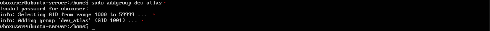
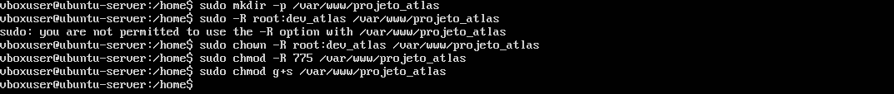

# IAM-Linux-Project

## Cenário Hipotético
## Empresa: Consultoria de Segurança "CyberDef."

### Servidor: SRV-WEB-01 (Ubuntu 22.04 LTS), que hospeda múltiplos projetos de clientes.

**Novo Colaborador:** Ana Silva, uma Desenvolvedora Web Júnior.

**Tarefa de Ana:** Ela foi designada para trabalhar exclusivamente no projeto_atlas, cujo diretório web está em /var/www/projeto_atlas. Suas responsabilidades são:

*Editar, criar e remover arquivos (PHP, JS, CSS) dentro do diretório do projeto.*

*Visualizar os logs de erro do Apache em tempo real para depurar seu código.*

*Restrições (Princípio do Menor Privilégio): Ana não deve ter permissão para:*

*Acessar diretórios de outros projetos (ex: /var/www/projeto_beta).*

*Reiniciar ou modificar a configuração do serviço Apache2.*

*Instalar pacotes ou modificar arquivos de sistema.*

*Acessar os diretórios /root ou /home de outros usuários.*

## Etapa de Provisionamento 

Aqui será detalhado o passo a passo do provisionamento da nova funcionária e demais etapas como o estabelecimento do *Princípio do Menor Privilégio* e *Politicas de Senhas*.

## 1. Garantimos que o grupo e o diretório do projeto estejam corretamente configurados antes de provisionar o usuário.

### Criar um grupo específico para os desenvolvedores deste projeto:




```sudo addgroup dev_atlas```
Se outro desenvolvedor se juntar ao projeto, basta adicioná-lo a este grupo, simplificando o gerenciamento.

## 2. Criar o diretório do projeto e atribuir as permissões base:




*Root* é o dono, *dev_atlas* é o grupo. Membros do grupo podem fazer tudo, outros só leem/executam, e o bit SGID (g+s) garante que novos arquivos pertençam ao grupo dev_atlas.

*Em desenvolvimento...*

## Etapa 2: Criação da Identidade Digital (ana.silva)

````
sudo useradd -m -s /bin/bash -g dev_atlas -c "Ana Silva - Dev Jr." ana.silva
````

## Etapa 3: Implementação da Política de Senhas

````
sudo passwd ana.silva
sudo passwd --expire ana.silva
````
Entregar uma senha temporária cria uma janela de oportunidade. Forçar a expiração mitiga esse risco, transferindo a responsabilidade da senha para o usuário final imediatamente.


